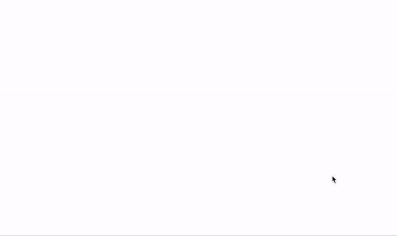

## [스켈레톤 ui 구현하기](https://www.youtube.com/watch?v=sUKVJ6Z2j4E)



```
import React from "react";
import styled from "styled-components";

const SkeletonPulse = styled.div`
  display: inline-block;
  width: 100%;
  height: 100%;
  background: linear-gradient(-90deg, #f0f0f0 0%, #f8f8f8 50%, #f0f0f0 100%);
  background-size: 400% 400%;

  border-radius: ${(props) => `${props.borderRadius}px` || "0px"};

  animation: pulse 1.2s ease-in infinite;
  @keyframes pulse {
    0% {
      background-position: 0% 0%;
    }
    100% {
      background-position: -140% 0%;
    }
  }
`;

export const Skeleton = (props) => {
  return <SkeletonPulse {...props} />;
};
```

이 컴포넌트가 핵심임!
